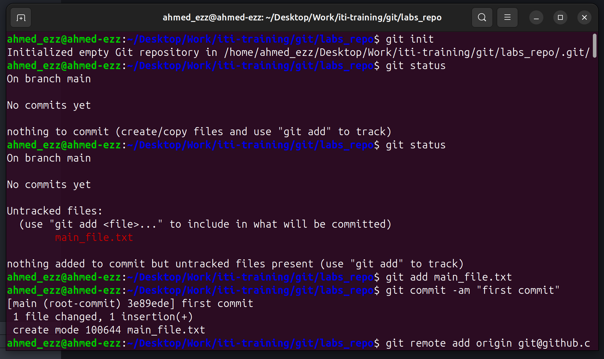
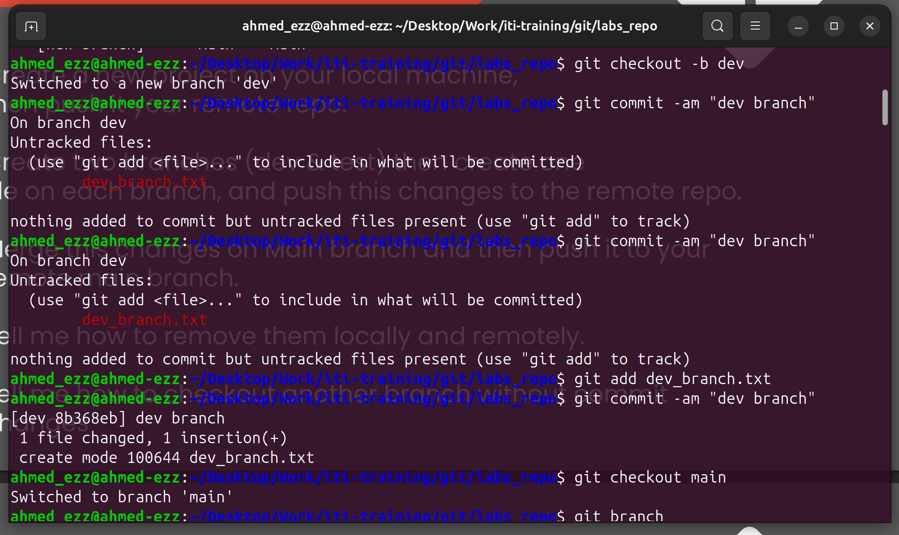
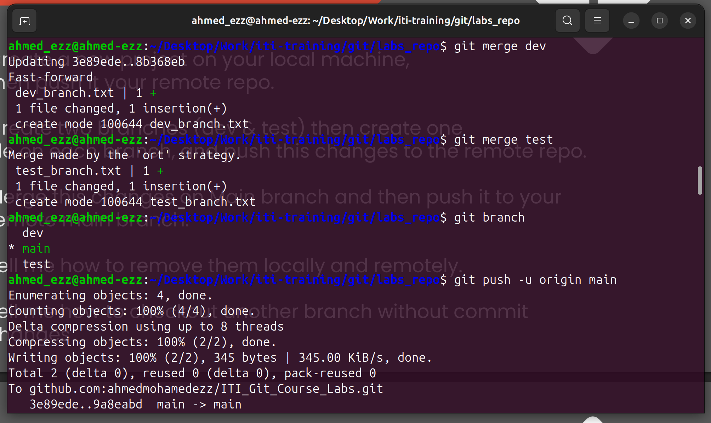
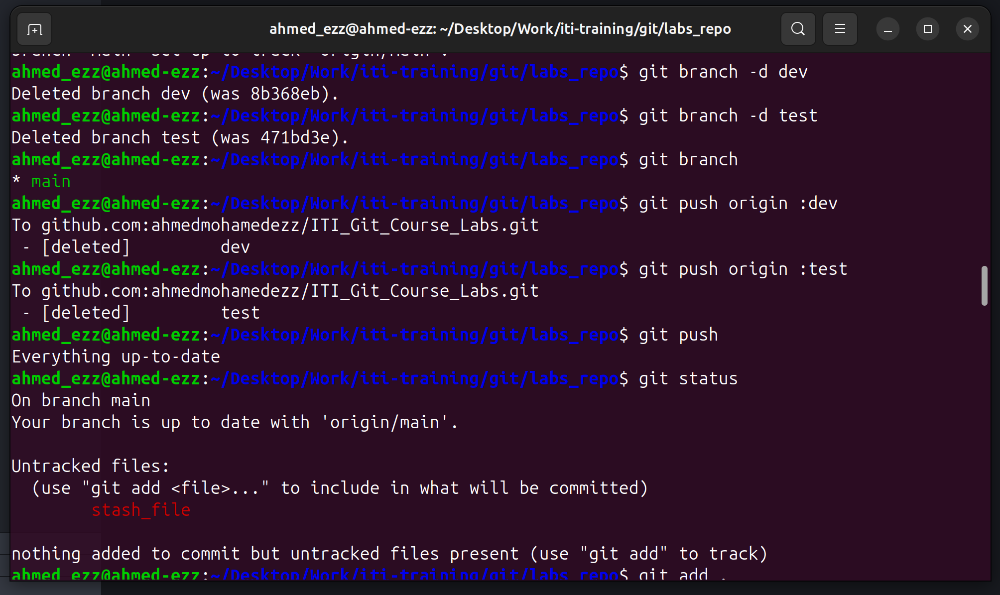
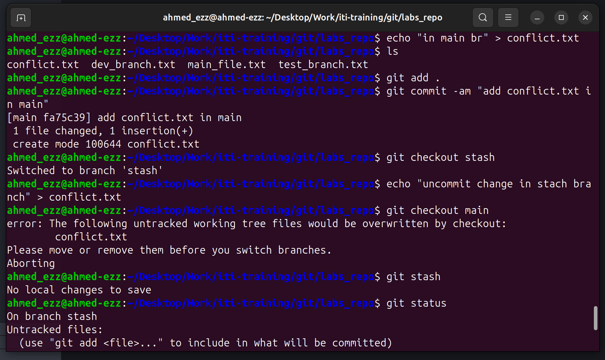
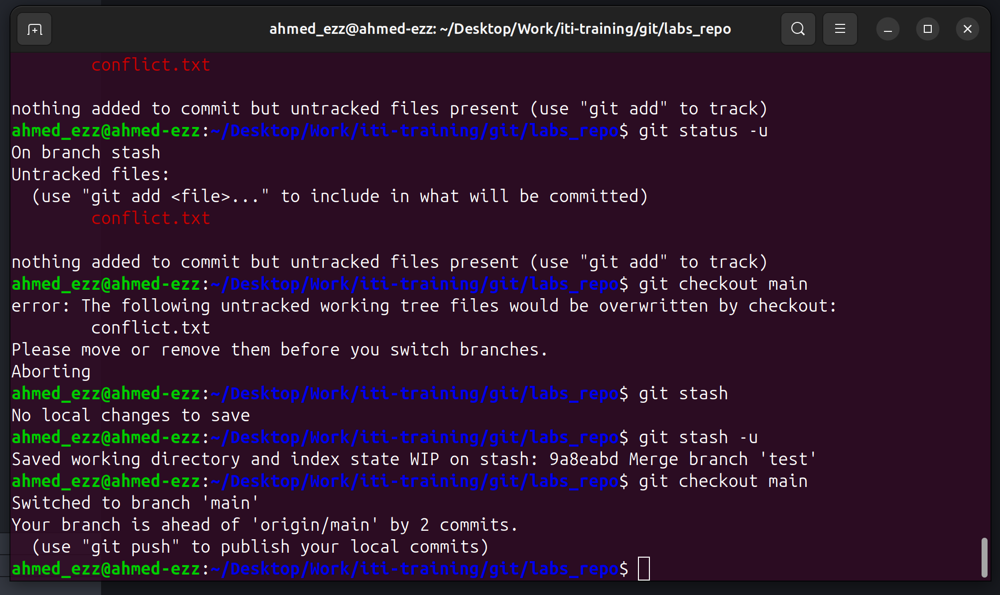
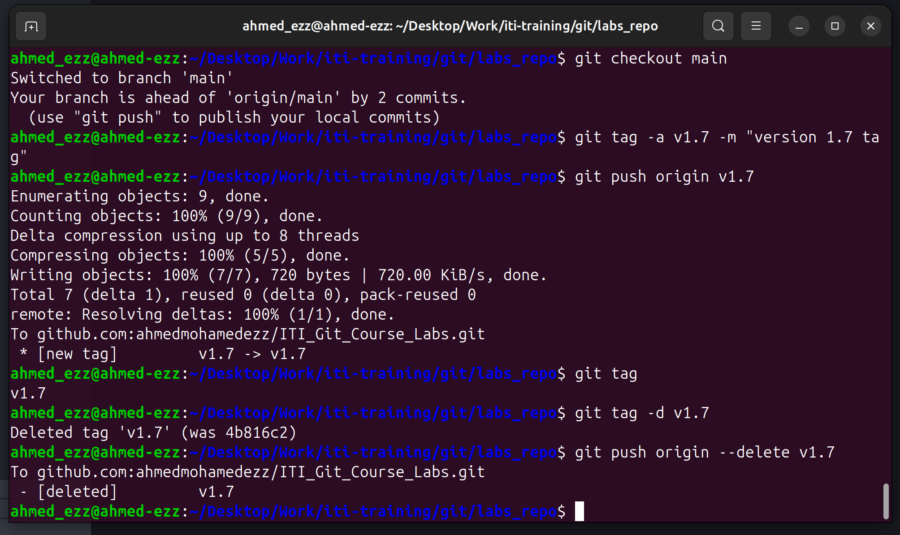

# ITI Git Course Labs

This repository contains lab exercises for the **ITI Git Course**, demonstrating Git workflows, commands, branching, merging, stashing, and more.

- look at the commits log to see deleted branches (dev & test)

---

## 📁 Repository Structure

ITI_Git_Course_Labs/

├── screenshots/

│ └── git_commands.png

├── README.md

└── … other files

---

## Steps in Screenshots

